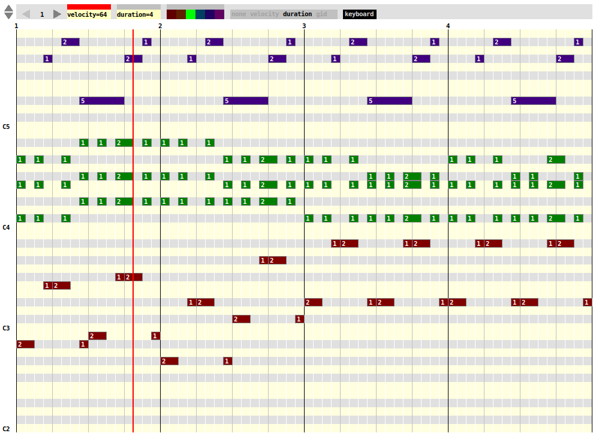

## unpunch - a configurable matrix sequencer for Pd

This is a matrix sequencer abstraction using Pd's data structures. Some
people also refer to this type as piano-roll sequencer where notes are
arranged on a grid whith the vertical axis representing the pitch and
the horizontal axis representing the time.

### Features

  * The visual representation is configurable and allows flexible usage
    for different window sizes and time signatures.

  * Editing notes and navigation is done with mouse actions, modifier keys
    and key commands.

  * Internal state can be dumped and restored.

### Dependencies

 * A somewhat recent Pd version

### Authors

 * Roman Haefeli

### Licence

Please check LICENSE.txt

